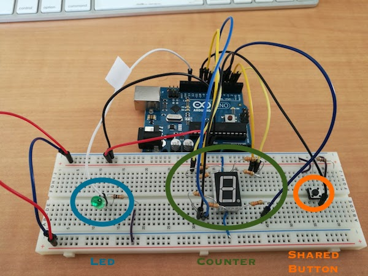
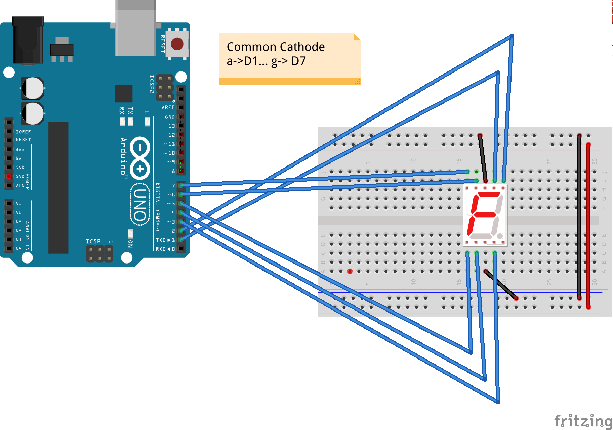

# SEC-Lab 1: ArduinoML

  * M2 IF, ENS Lyon
  * Sébastien Mosser, Université Cote d'Azur, I3S, [email](mailto:mosser@i3s.unice.fr)
  * Laure Gonnord, Université Lyon 1, LIP [email](mailto:laure.gonnord@ens-lyon.fr)
  * Version: 2017.05

## Problem Description

** TODO : change the fig! **

## Domain Description

### Pre-installation (Arduino stuff)

  * You may have to install the following (Linux) packages: `arduino` ,
`gcc-avr` and `avrdude` (`avr-binutils` et `avr-libc` if they are not included)
  * `avrdude.conf` must be in `/usr/share/arduino/hardware/tools/` (if not you have to modify Makefiles).
  * The user should have the right to write on  the USB port : 
`usermod -aG dialout <username>`

### Some Arduino general information

Arduino/Genuino cards are free cards build around a Atmel AVR
microntroler. In this lab we will use  Arduino UNOs (atmega328p) like
in the following picture. The platform has a few numerical and
analogic I/Os where we will connect LEDs, buttons, seven segment led
displays...

The microcontroler itself is programmed with a bootloader so that a dedicated
system is not necessary. The Makefile we give you will use   `avrdude`
[doc](http://www.nongnu.org/avrdude/) to load the binaries into the
microcontroler memory.

You will be given a whole platform with an arduino UNO, some leds, a
breadboard, wires ...  **You will be responsible for them for the
duration of the lab** On the breadboards, all points in a given
supply line (blue/black, read) are connected. Same for the columns.

## Example Applications

### Switch the light on!

* Led on digital 13 with 220 ohm resistor. (long leg to digital 13) 
* Button on digital 10, and 220 ohm resistor.

### Count to 9

* The seven segment displays can be "common cathode" or "common anode":

* 7 segment : a on digital 1 via resistor 220 ohm, b on digital 2, ...
  g on digital 7, according to the preceeding numbering. For instance,
  for the Comon Cathode setting:

**Warning, the 7 segment displays should be connected though resistors
(from 220 to 400 ohm)**

### The all together

The expected behavior from your code: the seven segment display numbers
from 0 to 9 then 0, and so one, with a frequency of 1Hz. Of the user
press the button, then it resets and continue to count from 0. The led
changes its state (on/off) every time the button is pressed.

## Steps

In this lab, you will implement the very same (simple) behavior, at different levels of abstraction. This journey through abstraction levels will help you to identify the pros and cons of each level, and the importance of model-driven engineering and domain-specific languages to reason about domains.

  1. [Plain old C code](https://github.com/mosser/sec-labs/blob/master/lab_1/step_1.md)
  2. [Using the ArduinoLib](https://github.com/mosser/sec-labs/blob/master/lab_1/step_2.md)
  3. [Implementing a Finite State Machine](https://github.com/mosser/sec-labs/blob/master/lab_1/step_3.md)
  4. [Modelling a Finite state machine](https://github.com/mosser/sec-labs/blob/master/lab_1/step_4.md)
  5. [Using an existing language: Lustre](https://github.com/mosser/sec-labs/blob/master/lab_1/step_5.md)
  6. [Implementing an external compiler](https://github.com/mosser/sec-labs/blob/master/lab_1/step_6.md)
  7. [Embedding inside an host language](https://github.com/mosser/sec-labs/blob/master/lab_1/step_7.md)
  8. [Using a DSL workbench](https://github.com/mosser/sec-labs/blob/master/lab_1/step_8.md)
